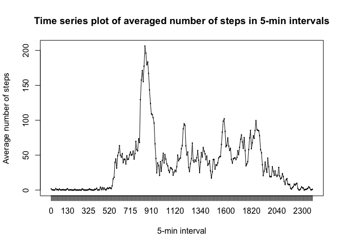

# Reproducible Research: Peer Assessment 1


## Loading and preprocessing the data

```r
unzip("activity.zip")
activity<-read.csv("activity.csv")
```

## What is mean total number of steps taken per day?
1. Calculate the total number of steps taken per day
    
    ```r
    library(dplyr, warn.conflicts = FALSE, quietly=TRUE)
    groupdate<-group_by(activity,date)
    dayactivity<-summarise(groupdate,totalsteps=sum(steps))
    head(dayactivity)
    ```
    
    ```
    ## # A tibble: 6 × 2
    ##         date totalsteps
    ##       <fctr>      <int>
    ## 1 2012-10-01         NA
    ## 2 2012-10-02        126
    ## 3 2012-10-03      11352
    ## 4 2012-10-04      12116
    ## 5 2012-10-05      13294
    ## 6 2012-10-06      15420
    ```
    
2. Make a histogram of the total number of steps taken each day
    
    ```r
    hist(dayactivity$totalsteps, xlab="Total steps/day", main = "Histogram of total number of steps per day", breaks = 10)
    ```
    
    <!-- -->

3. Calculate and report the mean and median of the total number of steps taken per day
    
    ```r
    meantotal<-mean(dayactivity$totalsteps, na.rm = T)
    meantotal
    ```
    
    ```
    ## [1] 10766.19
    ```
    
    ```r
    mediantotal<-median(dayactivity$totalsteps, na.rm = T)
    mediantotal
    ```
    
    ```
    ## [1] 10765
    ```
    The **mean** value of the total number of steps taken per day is **10766.19**.  
    The **median** value of the total number of steps taken per day is **10765**.
    
## What is the average daily activity pattern?
1. Make a time series plot (i.e. 𝚝𝚢𝚙𝚎 = "𝚕") of the 5-minute interval (x-axis) and the average number of steps taken, averaged across all days (y-axis)

- Calculate the averaged 5-min interval steps across all the days 
    
    ```r
    activity$interval <- as.factor(activity$interval)
    groupinterval<-group_by(activity,interval)
    meanintsteps<-summarise(groupinterval,meansteps=mean(steps,na.rm=T))
    head(meanintsteps)
    ```
    
    ```
    ## # A tibble: 6 × 2
    ##   interval meansteps
    ##     <fctr>     <dbl>
    ## 1        0 1.7169811
    ## 2        5 0.3396226
    ## 3       10 0.1320755
    ## 4       15 0.1509434
    ## 5       20 0.0754717
    ## 6       25 2.0943396
    ```
- Make the time series plot
    
    ```r
    plot(meanintsteps$interval,meanintsteps$meansteps, xlab="5-min interval", ylab="Average number of steps", main="Time series plot of averaged number of steps in 5-min intervals")
    lines(meanintsteps$interval,meanintsteps$meansteps,type="l")
    ```
    
    <!-- -->
2. Which 5-minute interval, on average across all the days in the dataset, contains the maximum number of steps?
    
    ```r
    maxint<-meanintsteps$interval[which.max(meanintsteps$meansteps)]
    maxint
    ```
    
    ```
    ## [1] 835
    ## 288 Levels: 0 5 10 15 20 25 30 35 40 45 50 55 100 105 110 115 120 ... 2355
    ```
    The **835** interval, which stands for **8:35am to 8:40am**, contains the maximum number of stesp.
    
## Imputing missing values
1. Calculate and report the total number of missing values in the dataset (i.e. the total number of rows with 𝙽𝙰s)
    
    ```r
    missings<-sum(is.na(activity$steps))
    missings
    ```
    
    ```
    ## [1] 2304
    ```
    
    There are totally **2304** missing values in the dataset.

2. Devise a strategy for filling in all of the missing values in the dataset  
    Use **the mean for that 5-min interval** to fill in missing values. 
    
3. Create a new dataset that is equal to the original dataset but with the missing data filled in
    
    ```r
    activity1 <- activity %>% mutate(interval=factor(interval))
    for (i in 1:17568)
    {
        if(is.na(activity1$steps[i]))
        {
            activity1$steps[i] <- meanintsteps$meansteps[which(meanintsteps$interval==activity1$interval[i])] 
        }
    }
    head(activity1)
    ```
    
    ```
    ##       steps       date interval
    ## 1 1.7169811 2012-10-01        0
    ## 2 0.3396226 2012-10-01        5
    ## 3 0.1320755 2012-10-01       10
    ## 4 0.1509434 2012-10-01       15
    ## 5 0.0754717 2012-10-01       20
    ## 6 2.0943396 2012-10-01       25
    ```
    
4. Make a histogram of the total number of steps taken each day. 
    
    ```r
    groupdate1<-group_by(activity1,date)
    dayactivity1<-summarise(groupdate1,totalsteps=sum(steps))
    hist(dayactivity1$totalsteps, xlab="Total steps/day", main = "Histogram of total number of steps per day (w/o missing values)", breaks = 10)
    ```
    
    <!-- -->
    
- Calculate and report the mean and median total number of steps taken per day.  
    
    ```r
    meantotal1<-mean(dayactivity1$totalsteps)
    meantotal1
    ```
    
    ```
    ## [1] 10766.19
    ```
    
    ```r
    mediantotal1<-median(dayactivity1$totalsteps)
    mediantotal1
    ```
    
    ```
    ## [1] 10766.19
    ```
    The **mean** value of the total number of steps taken per day is **10766.19**.  
    The **median** value of the total number of steps taken per day is **10766.19**.

- Do these values differ from the estimates from the first part of the assignment? What is the impact of imputing missing data on the estimates of the total daily number of steps?  
    These values are **not different** from the estimates from the first part of the assignment. The only impact of imputing missing data is that **all step values become numeric, instead of integer, resulting in a numeric median value**. 
    
## Are there differences in activity patterns between weekdays and weekends?
1. Create a new factor variable in the dataset with two levels – “weekday” and “weekend” indicating whether a given date is a weekday or weekend day.
    
    ```r
    activity2<-activity1 %>% mutate(weekday=weekdays(as.Date(activity1$date)))
    for (i in 1:17568)
    {
        if(activity2$weekday[i]=="Monday" | activity2$weekday[i]=="Tuesday" |
           activity2$weekday[i]=="Wednesday" | activity2$weekday[i]=="Thursday" |
           activity2$weekday[i]=="Friday")
        {
           activity2$weekday[i]="weekday"
        }
        if(activity2$weekday[i]=="Saturday" | activity2$weekday[i]=="Sunday")
        {
            activity2$weekday[i]="weekend"
        }
    }
    activity2<-mutate(activity2,weekday=factor(weekday))
    head(activity2)
    ```
    
    ```
    ##       steps       date interval weekday
    ## 1 1.7169811 2012-10-01        0 weekday
    ## 2 0.3396226 2012-10-01        5 weekday
    ## 3 0.1320755 2012-10-01       10 weekday
    ## 4 0.1509434 2012-10-01       15 weekday
    ## 5 0.0754717 2012-10-01       20 weekday
    ## 6 2.0943396 2012-10-01       25 weekday
    ```
2. Make a panel plot containing a time series plot of the 5-minute interval (x-axis) and the average number of steps taken, averaged across all weekday days or weekend days (y-axis).
    
    ```r
    groupIntWeek<-group_by(activity2,interval,weekday)
    meanIntWeek<-summarise(groupIntWeek,meansteps=mean(steps))
    meanIntWeek$interval<-as.numeric(meanIntWeek$interval)
    library(ggplot2, warn.conflicts = FALSE, quietly=TRUE)
    g<-ggplot(meanIntWeek,aes(x=interval,y=meansteps))+
        geom_point()+
        geom_line()+
        facet_grid(weekday~.)+
        xlab("5-min interval")+
        ylab("Average number of steps")+
        scale_x_continuous(breaks = pretty(meanIntWeek$interval, n = 10))  
    g
    ```
    
    <!-- -->
